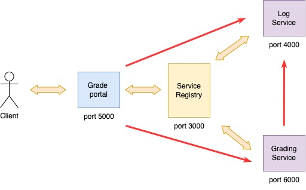

# Student Grade

an app for grading 

## Intro

This app is for practicing how to create distributed web application with Go standard library

## Features

- ✅ Log Service
- ✅ Service Registry
- ✅ Grading Service
    - ✅ Service Discovery
    - ❎ Notifying is started or stopped
- ❎ Teacher Portal
    - ❎ Status Monitoring

